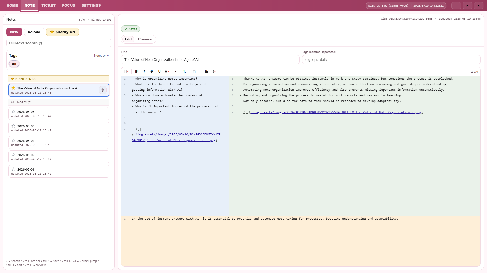

# CattitudeFlow Overview

## About the App

**CattitudeFlow** is a desktop application for personal reflection and daily organization, combining the Cornell note-taking method with a Markdown editor.

Notes are structured in three panes — **Cue / Note / Summary** — following the Cornell format, and everything you write is instantly visible as a clean, formatted preview.  
The **Ticket** feature lets you manage tasks with status, priority, due dates, and labels.  
The **Focus** feature automatically ranks your most important notes based on editing frequency and incoming references.

Whether for study, family planning, or everyday ideas, CattitudeFlow provides a quiet, structured space to keep your records organized and accessible.

## Key Features

| Feature | Description |
|---------|-------------|
| **Notes** | Cornell-style 3-pane editor (Cue / Note / Summary) with Markdown support |
| **Tickets** | Task management with status, priority, due date, and labels |
| **Home** | Unified list of notes, tickets, and TODOs with full-text search |
| **Focus** | Ranking view of notes and tickets by importance score |
| **Settings** | Theme, language, Workspace path, auto-save, and more |

## Keyboard Shortcuts

### Global

| Shortcut | Action |
|----------|--------|
| `Ctrl+K` | Focus the Home search bar |
| `Ctrl+Shift+T` | Apply today's date filter |
| `Ctrl+Mouse Wheel` | Zoom in / Zoom out |
| `Ctrl+0` | Reset zoom to 100% |

### Notes Screen

| Shortcut | Action |
|----------|--------|
| `Ctrl+Enter` / `Ctrl+S` | Save |
| `Ctrl+1` | Jump to the Cue pane |
| `Ctrl+2` | Jump to the Note pane |
| `Ctrl+3` | Jump to the Summary pane |
| `Ctrl+E` | Switch to Edit tab |
| `Ctrl+P` | Switch to Preview tab |
| `/` | Focus the note search bar |

### Tickets Screen

| Shortcut | Action |
|----------|--------|
| `Ctrl+Enter` | Save |
| `/` | Focus the ticket search bar |

### Focus Screen

| Shortcut | Action |
|----------|--------|
| `Enter` | Open the selected item |
| `ESC` | Close the fullscreen viewer |

### Home Screen

| Shortcut | Action |
|----------|--------|
| `Enter` / `Ctrl+Click` | Navigate to the selected item |

## Inserting Images

In the editor (Notes and Tickets), images can be pasted using either of the following methods.  
Pasted images are automatically saved to the Workspace and inserted as Markdown image syntax.

### ① Copy & Paste from File Explorer

1. Select an image file in File Explorer and press `Ctrl+C`
2. Click inside the editor and press `Ctrl+V`
3. The image is saved automatically and inserted into the note

> Supported formats: PNG, JPEG, GIF, WebP, and other common image types.

### ② Paste from Screen Capture

1. Use `Win + Shift + S` (Snipping Tool) or similar to capture a region of the screen
2. Click inside the editor and press `Ctrl+V`
3. The captured image is saved automatically and inserted into the note

> In both cases, an **"Importing image…"** overlay is displayed while the image is being processed.
