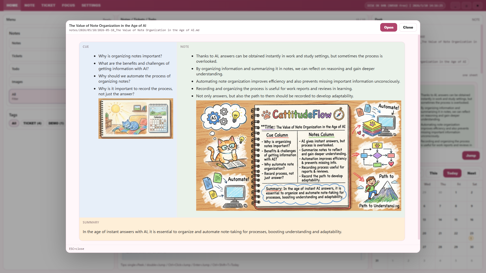

# CattitudeFlow Overview
- Microsoft Store
 https://apps.microsoft.com/detail/9n5ktn88cdh0?hl=en-En&gl=JP&ocid=pdpshare

## About the App

# CattitudeFlow v1.0.5 Release Notes

Release date: 2026-05-31  
Version: v1.0.5

## New Features

- OCR Memo
  Capture any area of your screen with a global hotkey (Ctrl+Shift+F12) or via the system tray,
  and the text is automatically recognized and saved as an OCR Memo.
  Supported languages: Japanese, English, Chinese, Korean, French, German.
  When "Save Image" is enabled in settings, a screenshot is also displayed in a cork board–style image area.

- Customizable Shortcut Keys
  You can now reassign the four global hotkeys (Show/Hide, Spotlight, Snippet, OCR)
  used by the resident app. Changes are made from the "Shortcut Keys" section in Settings
  and are reflected instantly in the system tray menu.

- Expanded System Tray Menu
  "Spotlight," "Snippet," and "OCR" entries have been added to the tray menu.
  Each entry shows its currently assigned hotkey.

## Improvements

- Enhanced Editor
  Added support for math rendering (KaTeX), footnotes, and syntax highlighting.
  Inline WYSIWYG-style preview makes Markdown content easier to read while editing.

- WPF 6-Language Support
  The system tray menu and native dialogs now display in the configured language
  (Japanese / English / Chinese / Korean / French / German).

## Bug Fixes

· Fixed a scrollbar overlap issue in the Focus page that caused screen flickering.
· Fixed an issue where OCR native DLLs were missing from the MSIX package.

---

# CattitudeFlow v1.0.4 Release Notes

Release date: 2026-05-24  
Version: v1.0.4

## Overview
CattitudeFlow v1.0.4 focuses on smoother day-to-day work across ticket memos, snippet reuse, and presentation-time visibility. Tickets can now hold multiple Cornell-style memos, and memo display, saving, and fullscreen behavior now feel much closer to the note experience. Snippet management is faster to reach from the title bar and keyboard, and it is easier to search, copy, and safely store reusable content. We also revisited startup, search, rendering, and file refresh behavior to improve overall responsiveness and stability.

## New Features
- Added a Spotlight Cursor for presentations and screen sharing. You can toggle it from the title-bar ☀ button or with Alt+P, and switch between five presets depending on the situation.
- Added a Memo tab to ticket details. A single ticket can now hold multiple memos for meeting notes, research notes, and supporting material.
- Ticket memos now support Cornell 1 / 2 / 3-pane editing and preview, and can also be exported to PDF.
- Expanded the Snippet Manager dialog. You can now register, edit, delete, and copy snippets from the title bar or with Ctrl+I, with support for tag filtering and secure storage.

## Improvements
- Refined the Home screen note and ticket lists so child items and memo rows are easier to scan.
- Added editor and preview font settings so you can work with a font family and size that match your preference.
- Cleaned up the Settings screen navigation and layout, making language-related settings easier to understand and apply.
- Added the app icon to the startup loading screen so startup progress is easier to recognize.
- Improved how preview backgrounds are handled for on-screen preview and PDF export, producing results that better match what you see.

## Bug Fixes
- Improved file read/write error messages so they are shown clearly in all six supported languages.
- Reduced cases where note and ticket save/create actions could be triggered repeatedly by rapid clicks or double-submit behavior.
- Fixed cases where the Cornell Summary pane did not appear correctly, making 3-pane display more reliable.
- Fixed cut, paste, and selection-related issues in the editor context menu.
- Resolved multiple ticket memo issues, including fullscreen opening from Home and memo rows remaining visible after deletion.

## Performance Improvements
- Reduced startup scanning cost so larger workspaces open more quickly.
- Removed unnecessary re-renders in the editor, preview, and note screen for smoother typing and screen changes.
- Optimized Home screen search so results appear faster.
- Improved page transitions by cancelling work that is no longer needed when you move between screens.
- Made external file changes appear much closer to real time when files are edited outside the app.

## Developer Information
- ISS-035 cleaned up AbortSignal wiring in the RPC flow so unnecessary work can be stopped safely during navigation.
- ISS-036 / 037 / 038 / 039 / 046 / 058 optimized the internal implementation for startup scanning, search, rendering, and file refresh.
- ISS-055 / 056 advanced the i18n audit and WPF native localization so language behavior is more consistent across the app.
- ISS-057 delivered architectural cleanup including code splitting, settings-store consolidation, and clearer service-layer boundaries.
- ISS-061 stabilized the bulk ticket creation E2E scenario.

## Known Issues
- No major known issues that block everyday use have been identified at release time.
- Further responsiveness work for large workspaces and additional UI polish will continue in the next version.
